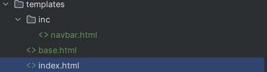

# Social media website | Django

go to setting.py and add this

#### setting.py
```python
INSTALLED_APPS = [
    "django.contrib.admin",
    "django.contrib.auth",
    "django.contrib.contenttypes",
    "django.contrib.sessions",
    "django.contrib.messages",
    "django.contrib.staticfiles",
    "Home.apps.HomeConfig",             #add this

```
#### setting.py 
```python
TEMPLATES = [
    {
        "BACKEND": "django.template.backends.django.DjangoTemplates",
        "DIRS": [BASE_DIR / "templates"],
        "APP_DIRS": True,       ######################
        "OPTIONS": {
            "context_processors": [
                "django.template.context_processors.debug",
                "django.template.context_processors.request",
                "django.contrib.auth.context_processors.auth",
                "django.contrib.messages.context_processors.messages",
            ],
        },
    },
]
```
`"APP_DIRS": True`
this code is for that if we have had not a templates directory in base directory 
django search in that app for templates 
## Add templates to project 


## Cbv in django
```python
from django.views import View
class HomeView(View):
    def get(self, request):
        return render(request , "home/index.html")
    def post(self, request):
        return render(request, "home/index.html")
```
## widget
```python

```


